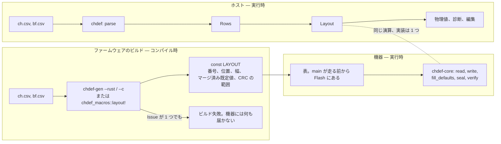

# 組み込み

🌐 [English](./embedded.md) | **日本語**

実装済み（0.0.17）: 生値だけを扱う中核（`chdef-core`）— 位置、全ての幅と両方のバイト順での生値 ↔ バイト列、§4 の既定値の合成、[format.jp.md §6](./format.jp.md) の CRC レシピ — を、アロケータも浮動小数点も持たない `no_std` クレートとして。定義を Rust または C の定数表に展開する生成器（`chdef-gen`）と、その場に展開するマクロ（`chdef-macros`）。および中核の C 入口を静的ライブラリとしてビルドしたもの。未実装: ターゲット上の物理値（§3）。

## 1. ターゲットで動くもの

機器は定義ファイルを読まない。ファイルが記述するレイアウトを、ファームウェアをビルドした時点で固定したまま持ち、それに対して生のビットパターンを読み書きする。だから機器が chdef に求めるのは、[layout.jp.md](./layout.jp.md) と [conversion.jp.md](./conversion.jp.md) §3〜§4、[format.jp.md](./format.jp.md) §6 が定めるものだけ:

- 各チャンネルの位置と幅、およびフレームの合計。
- フレームから取り出す 1 チャンネルの生値と、レイアウトのバイト順でフレームへ書く生値。
- 各チャンネルの既定値。BF の行を合成したもの（§4）。
- 派生チャンネルが覆うバイト、その上の CRC、フレームがその値を保持しているか。

要らないのは、ホストで定義ファイルが存在する理由の全部 — parse、列の語彙、診断、物理値、Grid。どれもターゲットには無く、抱えておくアロケータも無い。

## 2. 規則の住所は 1 つ

上の規則の実装は `chdef-core` に 1 つだけある。`chdef` クレートはこれに依存し、同じ算術 — 生値 ↔ バイト列、CRC — をこれに任せる。だから [interchange.jp.md §3](./interchange.jp.md) のゴールデンベクタは、中核を直接にも、ホスト側の全経路を通しても保証する。同じフレームを読む機器とホストの答えが一致するのは、同じコードを走らせているからであって、2 つの実装を突き合わせたからではない。

`chdef-core` は `#![no_std]` で、何にも依存せず、確保せず、浮動小数点を使わない。ベアメタルのターゲット（CI が証明するのは `thumbv7em-none-eabihf`）にも、ホストにもビルドできる。

## 3. 定義が何になるか

`chdef-gen` は CH の CSV と、任意で BF の CSV を、ホストと同じように読み — 同じ parse、同じ語彙の規則 — レイアウトを定数として書き出す:

- `--rust`: `LAYOUT: chdef_core::Layout` と、チャンネルごとの定数 1 つずつを宣言する Rust のソース。
- `--c`: 同じものを `static const` の表として宣言し、中核の C 入口が取る `CHDEF_LAYOUT` を置く C のヘッダ。

Rust のクレートはファイルを省いてよい。`chdef-macros` クレートの `chdef_macros::layout!("ch.csv")` が、同じ項目をその場に展開する。パスは呼び出し側クレートの `CARGO_MANIFEST_DIR` からの相対。`bf = "bf.csv"`、`endian = big`、`japanese` は、コマンドのオプションと同じように CSV のパスに続ける。CSV が変わればクレートは再ビルドされ、拒まれた定義は同じ指摘を運ぶコンパイルエラーになる。

2 つの経路が共有するのはファイルと規則で、それ以外は何も共有しない:

つまり機器は、ホストが parse を終えて到達する地点 — レイアウト — から始まる。ホストだけが使うものを除いて。起動時に読み込むものは無く、表はリンカが置いたデータ。

定数が持つのは、チャンネルごとに番号・位置・幅・合成済みの既定値。派生チャンネルごとに、どの枠を埋めるか、CRC の 6 つのパラメータ、そのレシピが覆うバイト範囲 — チャンネル番号から位置へ解決済みのもの。名前、単位、`lsb`、`offset`、`min`、`max` その他の列は運ばない。ターゲットが使わないから。

**Issue が 1 つでもある定義は拒む。** `chdef-gen` は `chdef` が報告するとおりに指摘を出し、非ゼロで終了する。ホストなら警告つきで読み込む行も、警告する先の無い機器には届かない。

## 4. C の入口

中核は自分の操作を `chdef_core_` の名前で C に公開する。宣言は `crates/chdef-core/include/chdef_core.h`:

| 呼び出し | 何をするか |
|---|---|
| `chdef_core_read` | フレームから 1 チャンネルの生値 |
| `chdef_core_write` | フレームへ 1 チャンネルの生値 |
| `chdef_core_fill_defaults` | 全チャンネルの既定値をフレームへ |
| `chdef_core_seal` | 全ての派生チャンネルを計算して書く |
| `chdef_core_verify` | 全ての派生チャンネルが計算どおりの値を保持しているか |

どれも、生成された `CHDEF_LAYOUT`、フレームのポインタ、その長さを取り、成功なら `1`、フレームがレイアウトより短いかチャンネルがその中に無ければ `0` を返す。他のステータスは無い。運ぶ診断が無いから — 定義は表を生成した時点で検査済み。

## 5. 未規定

- ファームウェアのビルドがどう `chdef-gen` を呼ぶか。`build.rs`、Makefile の規則、生成結果をコミットしておくこと、どれも正しい使い方。
- ターゲットの `size_t` のビット幅。表の位置は `u32` で、4 GiB を超えるフレームはこの形式の外。
