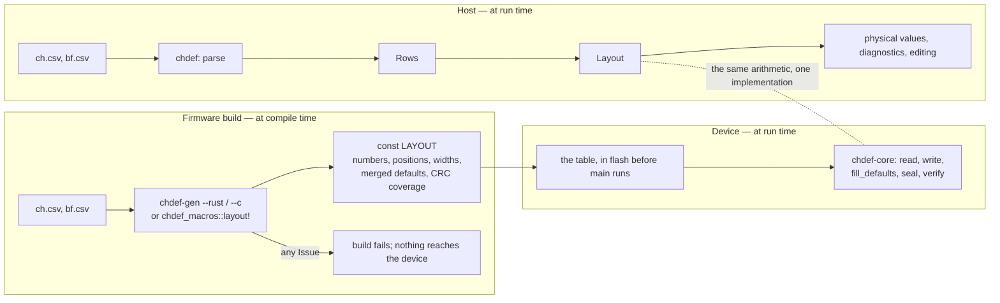

# Embedded

🌐 **English** | [日本語](./embedded.jp.md)

Implemented (0.0.17): the raw-only core (`chdef-core`) — positions,
raw ↔ bytes at every width and both byte orders, the merged default of
§4, and the CRC recipes of [format.md §6](./format.md) — as a `no_std`
crate with no allocator and no floating point; the generator
(`chdef-gen`) that expands a definition into a constant table for Rust
or C, and the macro (`chdef-macros`) that expands it in place; and the
C entry points of the core, built as a static library. Not implemented:
physical values on the target (§3).

## 1. What runs on the target

A device does not read a definition file. It holds the layout the file
describes, fixed when the firmware was built, and reads and writes raw
bit patterns against it. What it needs from chdef is therefore what
[layout.md](./layout.md) and [conversion.md](./conversion.md) §3–§4 and
[format.md](./format.md) §6 state:

- the position and width of each channel, and the frame's total;
- a channel's raw value out of a frame, and into one, in the layout's
  byte order;
- the default of every channel, with its BF rows merged (§4);
- the bytes a derived channel covers, the CRC over them, and whether the
  frame holds that value.

What it does not need is everything a definition file exists for on the
host: parsing, column vocabularies, diagnostics, physical values, the
grid. None of that is on the target, and the target has no allocator to
hold it.

## 2. One home for the rules

The rules above have one implementation, in `chdef-core`. The `chdef`
crate depends on it and calls it for the same arithmetic — raw ↔ bytes,
CRC — so the golden vectors of [interchange.md §3](./interchange.md)
certify the core through every host path as well as directly. A device
and a host reading the same frame agree because they run the same code,
not because two implementations were compared.

`chdef-core` is `#![no_std]`, depends on nothing, allocates nothing and
uses no floating point. It builds for a bare target
(`thumbv7em-none-eabihf` is the one CI proves) and for the host.

## 3. What a definition becomes

`chdef-gen` reads a CH CSV and an optional BF CSV as the host does —
the same parse, the same vocabulary rules — and writes the layout out
as a constant:

- `--rust`: a Rust source file declaring `LAYOUT: chdef_core::Layout`
  and one constant per channel;
- `--c`: a C header declaring `static const` tables of the same and a
  `CHDEF_LAYOUT` the core's C entry points take.

A Rust crate may skip the file: `chdef_macros::layout!("ch.csv")` from
the `chdef-macros` crate expands to the same items in place. The path is
relative to the invoking crate's `CARGO_MANIFEST_DIR`; `bf = "bf.csv"`,
`endian = big` and `japanese` follow the CSV path as the command's
options do. The crate rebuilds when the CSV changes, and a refused
definition is a compile error carrying the same findings.

The two paths share the file and the rules, and nothing else:

A device therefore starts where a host arrives after parsing — with
the layout — minus what only a host uses. Nothing is loaded at boot;
the table is data the linker placed.

The constant holds, per channel: its number, position, width, and
merged default. Per derived channel: which slot it fills, the six CRC
parameters, and the byte ranges its recipe covers, already resolved from
channel numbers to offsets. Names, units, `lsb`, `offset`, `min`, `max`
and every other column are not carried: the target does not use them.

**A definition with any Issue is refused.** `chdef-gen` prints the
findings as `chdef` reports them and exits non-zero. A row the host
would load with a warning does not reach a device, where nothing can
warn.

## 4. The C entry points

The core exposes its operations to C under `chdef_core_` names,
declared in `crates/chdef-core/include/chdef_core.h`:

| Call | Does |
|---|---|
| `chdef_core_read` | one channel's raw value out of a frame |
| `chdef_core_write` | one channel's raw value into a frame |
| `chdef_core_fill_defaults` | every channel's default into a frame |
| `chdef_core_seal` | every derived channel computed and written |
| `chdef_core_verify` | whether every derived channel holds its computed value |

Each takes the generated `CHDEF_LAYOUT`, a frame pointer and its
length, and returns `1` on success and `0` when the frame is shorter
than the layout or the channel is not in it. No other status exists:
there is no diagnostic to carry, because the definition was checked
when the table was generated.

## 5. Unspecified

- How the firmware build invokes `chdef-gen`. A `build.rs`, a Makefile
  rule and a checked-in generated file are all correct uses.
- The bit width of `size_t` on the target. Positions are `u32` in the
  table; a frame longer than 4 GiB is outside this format.
